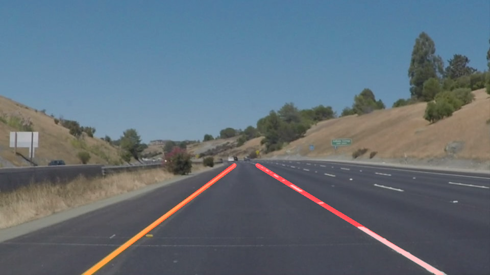
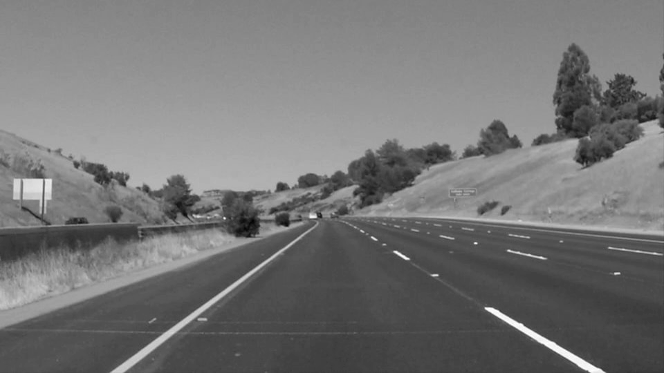
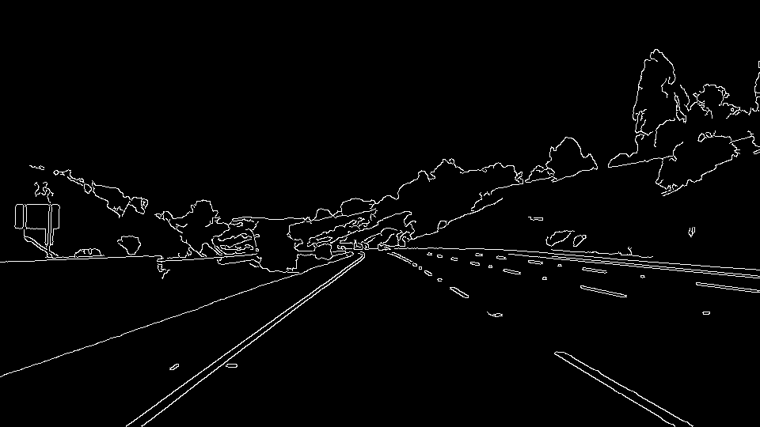
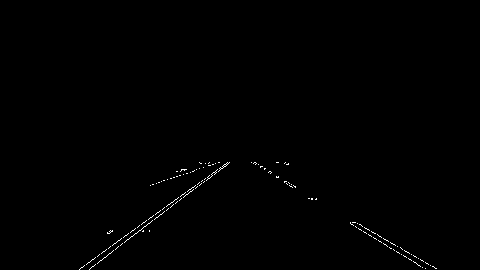
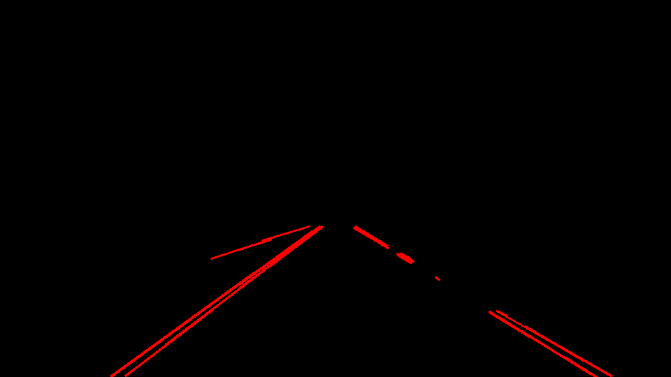

# **Finding Lane Lines on the Road** 

__The goal of this project is to find the lanes on the road and highlight them in red.__

### 1. The pipeline.
A pipeline was created to accomplish this task. The pipeline processes one image at a time, and uses several steps described below to draw lanes on an image. The code for accomplishing this task is included in the accompanying jupyter notebook. 

The main function for the pipeline is called draw_lines() and was taken largely from example code found in the section on Computer Vision Fundamentals. The function draw_lines() calls my function find_lanes() whose main purpose is find 2 lanes from a number of possible lines obtained from the image.  The code is summarized below.

#### The Code
The function **draw_lines()** does the following tasks:
1. Applies a red color mask to the color image and then converts it to gray scale.  
2. Blurs the image with Gaussian noise and then finds edges in the blurred image using the Canny algorithm. 
3. Selects out a trapezoid that encompasses the road and removes scenery and sky.
4. Uses a Hough line algorithm to detect lines. 
5. Uses my function find_lanes() that takes the Hough lines and returns 2 lines representing the lanes. These lanes are then added to the image.

The function **find_lanes()** has the following logic and does the following tasks:
1. Takes the lines found using the Hough Line algorithm as input.  
2. Calculates the slope and intercept of each line, and then finds where the extrapolated line would cross the bottom of the image.  
3. For the **left lane**, it starts by looking for lines that would cross the bottom left-half of the image and that have a positive slope.  
4. It makes a histogram of the location where those expolated lines cross the bottom of the image.
5. It finds the highest peak of the histogram, and then uses the slopes and intecepts of those extrapolated lines that are clustered around the highest peak to compute an average slope and average intercept. Outliers are removed in the calculation of the averages.  
6. It then calculates the end-points of the lane using the average slope and average intercept.
7. For the **right lane**, it starts with lines that cross the bottom right-half of the image and have negative slope and then proceeds through steps 4-6.

#### The steps.
An example of how the pipeline code would work is giving in the following table.  

| Steps | Description | Image
|-------------|:-------------|:---:|
|1.|Convert the image from color to gray.    To improve the algorithm so that it works for the callenge video, I first apply a mask that hightlights red colors. ||
|2.|Apply the Canny algorithm to detect the edges after applying a Gaussian Noise Kernel to the image.||
|3.|Apply a mask that encompasses the road section and removes the scenery and sky. This is a trapezoid whose base is the bottom of the image and whose top is a little less than half of the image.||
|4.|Apply the Hough Line algorithm to detect the straight lines in the image.|| 
|5.|Apply my function find_lanes().  This function takes the lines found using the Hough Line algorithm and returns the 2 lane lines. ||

### 2. Potential issues with this pipeline

* This algorithm has issues when there is little contrast between the road and the lane markings.  This happens when the road surface is very bright, or when the lane markings are dark.
* This algorithm also has issues when the dotted lines of a lane in an image are largely missing.  It does not have a way to use information from the last frame when computing information in this frame.

### 3. Possible improvements to this pipeline

* One possible improvement would be to use other information from the original image.  Instead of creating a mask based on the color space RGB (red, green, blue), create a mask based on the HSV (hue, saturation and value) or HLS (hue, lightness, and saturation). 
* Another possible improvement would be to use information from the last frame in the current frame.  I would recommend using a moving average on the slope and intercept of the lanes.

